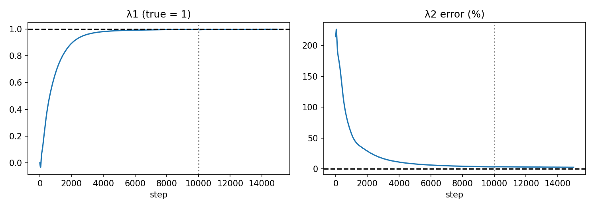
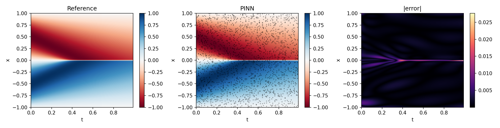

# Inverse-Burgers-PINN
A pure-PyTorch PINN that recovers the unknown coefficients of Burgers' equation u_t + λ1·u·u_x − λ2·u_xx = 0 (true λ1 = 1, λ2 = 0.01/π ≈ 0.003183) from 2000 sparse, noisy measurements.

## Idea
The network u(x,t) is trained to (a) match the noisy measurements and (b) satisfy the PDE at 10,000 collocation points. λ1 and λ2 are `nn.Parameter`s updated by the same optimizer as the network weights. λ2 is parameterized as 0.01·p so Adam's step size suits its tiny scale.

## Setup
- Data: 2000 random space-time points from `burgers_shock.mat` (Raissi et al.), Gaussian noise = 1% of std(u).
- Network: 8 hidden layers × 20 neurons, tanh, Xavier init (3023 params incl. λ1, p).
- Loss = 10·data + 1·PDE. No IC/BC terms.
- Training: Adam 10k steps (lr 1e-3, exp. decay 0.9997), then Adam 5k steps (lr 3e-4).

## Results (seed 0)
| Quantity | Learned | True | Error |
|---|---|---|---|
| λ1 | 0.9971 | 1.0 | 0.3% |
| λ2 | 0.00326 | 0.003183 | 2.6% |
| relL2 (full 256×100 grid, vs clean reference) | 0.0029 | | |

Data loss ends at the noise floor (4.0e-5 vs noise variance 3.8e-5): the network fits the signal, not the noise.

## Observations
- λ1 converges first (within 5% by step ~3000); λ2 needs ~7000 steps. λ1 multiplies an O(1) term everywhere, while λ2 only matters inside the thin shock.
- Largest field errors are at the shock for t < 0.4.

## Limitations / future work
- Single seed and noise draw; no error bars. Next: repeat over several seeds and noise levels (0.1%, 1%, 5%) and different λ initializations.
- λ2 was still drifting slowly; longer training may reduce the 2.6% gap.
- Synthetic, Gaussian noise only.

## Run
Open the notebook in Colab, run cells top to bottom (downloads burgers_shock.mat).
